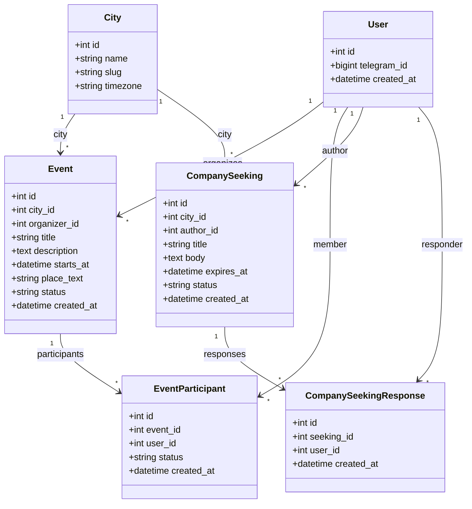

# Доменная модель (UML, черновик под MVP)

Цель: **события**, **участники**, **«ищу компанию»** отдельно, **города** с первой строкой «Москва», модерация на уровне статусов. Чат внутри события в MVP не моделируем — только связи пользователей.

## PlantUML ([PlantText](https://www.planttext.com) и аналоги)

В PlantText нужен синтаксис **PlantUML**, а не Mermaid. Строки вроде `classDiagram` / `direction TB` относятся к Mermaid и дают ошибку парсера.

Готовый файл для вставки в редактор: **`domain-model.puml`** (рядом с этим файлом). Скопируй содержимое `.puml` в [planttext.com](https://www.planttext.com) — диаграмма должна отрисоваться.

## Диаграмма классов (Mermaid)

## Статусы (смысл, не обязательно финальные имена в БД)

| Сущность | Статусы (пример) |
|----------|------------------|
| **Event** | `draft` → `pending_review` → `published` / `rejected` / `cancelled` |
| **EventParticipant** | `joined` / `left` (при необходимости позже `pending` от организатора) |
| **CompanySeeking** | как у событий: черновик / на проверке / опубликовано / снято |
| **CompanySeekingResponse** | факт отклика («хочу в компанию») |

## Примечания

- **MVP по городу**: в коде фильтр по `city_id` Москвы; таблица `cities` с одной строкой — задел на выбор городов.
- **Канал → бот**: вне БД в ссылке `?start=event_<id>` или `seek_<id>`; при первом `/start` создаётся/обновляется `User`.
- После согласования полей — отражать изменения в **Alembic** и в **`STRUCTURE.md`**.
