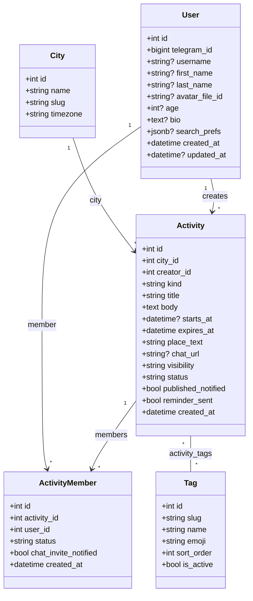

# Доменная модель

После унификации в `Activity` событие и заявка «ищу компанию» — одна и та
же сущность с дискриминатором `kind` (`'event'` | `'seeking'`). Чат
внутри активности — ручная Telegram-ссылка `chat_url` (бот не создаёт
группы сам, см. `tech-debt.md`).

Источники истины (актуализировать при изменениях): ORM в `bot/models/`,
миграции в `alembic/versions/001_*` … `007_*`, обзор путей —
в `STRUCTURE.md`.

## PlantUML ([PlantText](https://www.planttext.com) и аналоги)

В PlantText нужен синтаксис **PlantUML**, а не Mermaid. Готовый файл —
**`domain-model.puml`** (рядом с этим файлом). Скопируй содержимое в
[planttext.com](https://www.planttext.com) — диаграмма нарисуется.

## Диаграмма классов (Mermaid)



## Семантика `kind`

| `kind` | `starts_at` | `expires_at` | `place_text` | Лента |
|---|---|---|---|---|
| `'event'`   | обязательно — когда происходит | `starts_at + duration` (мин. 2 ч), фильтр «не истекло» | заполнен | сортировка по `starts_at` ASC |
| `'seeking'` | NULL | задаётся при создании (1/3/7 дней) | пустой | сортировка по `created_at` DESC |

## `visibility` и approval-flow

| `visibility` | Поведение «join» |
|---|---|
| `'open'` (дефолт) | сразу `ActivityMember.status = 'joined'` |
| `'private'` | `ActivityMember.status = 'pending'`, организатору приходит DM с кнопками ✅/❌ |

- Дефолт `'open'`. Менять — в профиле, кнопка «🔒 Доступ» у каждой
  своей активности.
- Approve → `joined`, и пользователь получает DM с (если есть)
  ссылкой на чат.
- Reject → запись удаляется (без отдельного `'rejected'`-статуса),
  пользователь может подать заявку ещё раз. Сообщение об отказе всё
  равно приходит.
- Cancel активности шлёт уведомление и `joined`, и `pending` членам.
- `chat_url` доступен только `joined` — не `pending`. Это касается и
  моментального инвайта при join, и broadcast при первом заполнении
  ссылки.

## Связи и уникальности

- `activity_members(activity_id, user_id)` — `UNIQUE`, чтобы один
  пользователь не мог записаться дважды (ни как pending, ни как joined).
- Many-to-many теги: ассоциативная таблица `activity_tags(activity_id,
  tag_id)`, `ON DELETE CASCADE` со стороны activity и `ON DELETE
  RESTRICT` со стороны tag.
- `users.telegram_id` — `UNIQUE`, индекс.

## Индексы (под текущие запросы)

- `activities(city_id, status, starts_at)` — лента событий.
- `activities(city_id, status, expires_at)` — лента заявок и общий
  фильтр «не истёкших».
- `activities(kind)`, `activities(creator_id)` — выборки по
  дискриминатору и автору.
- `activity_tags(tag_id)` — фильтр ленты по тегам.

## Статусы (смысл, не обязательно финальные имена в БД)

| Сущность | Статусы |
|----------|---------|
| **Activity** | `draft` → `pending_review` → `published` / `rejected` / `cancelled` / `closed` |
| **ActivityMember** | `pending` (только для `private`) → `joined`. На leave/withdraw/reject — строка просто удаляется. |

## Поля-флаги уведомлений

- `activities.published_notified` — взведено, когда модератор опубликовал
  и автор получил DM (`bot/scheduler.py`).
- `activities.reminder_sent` — за 2 часа до `starts_at` всем `joined`
  участникам ушло напоминание. Для `kind='seeking'` не используется.
- `activity_members.chat_invite_notified` — этому участнику уже отправили
  инвайт-ссылку (либо при join, либо в рассылке после первого
  заполнения `chat_url`). Pending-членам инвайт не шлётся, флаг для них
  остаётся `false` до approve.

## `users.search_prefs` (JSONB)

Сохранённый пользовательский фильтр — переживает рестарты и сброс FSM.
Формат:

```json
{
  "event_tag_ids":   [int, ...],
  "seeking_tag_ids": [int, ...]
}
```

Отсутствующий ключ или пустой массив — «фильтр не задан». Фильтры
разделены на два набора, потому что у пользователя визуально две ленты
(«📍 Найти событие» и «🤝 Найти компанию»), и логично иметь
независимые предпочтения.

## Теги — фиксированный справочник

Список `tags` правится **только новой миграцией**. Стартовый набор
сидится в `005_tags_and_search_prefs.py` (`bars`, `board_games`, `cinema`,
`exhibitions`, `concerts`, `sport`, `walk`, `food`, `talk`, `other`).
У активности может быть N тегов, при создании требуется минимум один.

## Примечания

- **MVP по городу**: в коде фильтр по `city_id` Москвы; таблица `cities`
  с одной строкой — задел на выбор городов.
- **Канал → бот**: deep link канонически `?start=act_<id>`. Старые
  форматы `event_<id>` / `seek_<id>` не резолвятся (id не сохранены при
  миграции 007), бот честно говорит «ссылка устарела» и предлагает
  открыть ленту.
- При первом `/start` создаётся/обновляется `User`.
- После согласования полей — отражать изменения в **Alembic**, ORM и в
  **`STRUCTURE.md`**.
