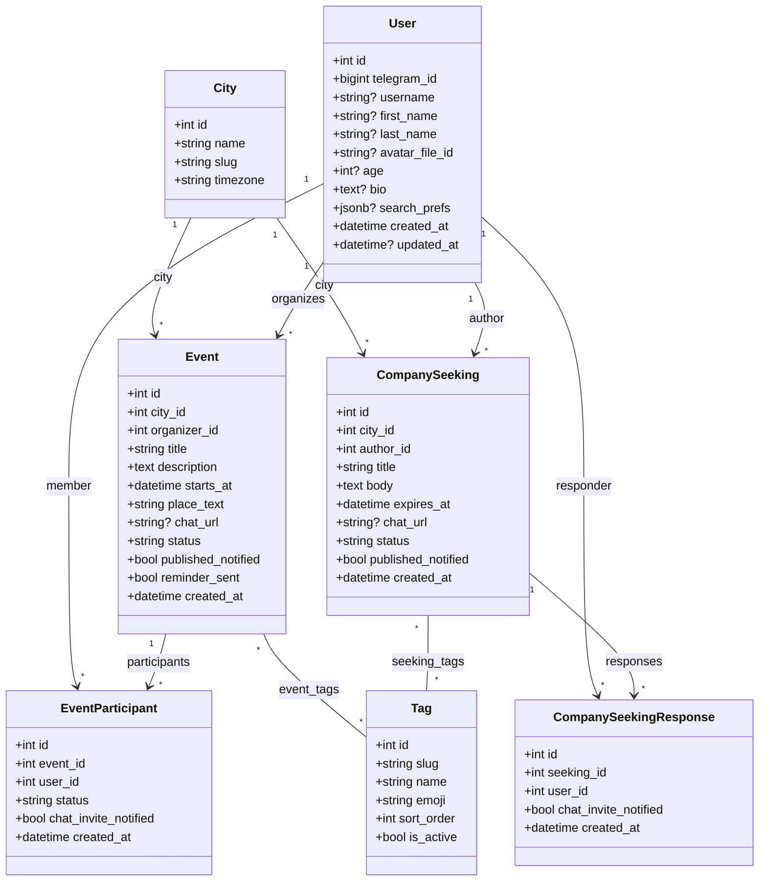

# Доменная модель

Цель: **события**, **участники**, **«ищу компанию»** отдельно, **города** с первой строкой «Москва», модерация на уровне статусов. Чат внутри события/заявки моделируется как ручная Telegram-ссылка (`chat_url`) — авто-создание групп пока не делаем (бот не имеет права в Bot API).

Источники истины (актуализировать при изменениях): ORM в `bot/models/`, миграции в `alembic/versions/001_*` … `006_*`, обзор путей — в `STRUCTURE.md`.

## PlantUML ([PlantText](https://www.planttext.com) и аналоги)

В PlantText нужен синтаксис **PlantUML**, а не Mermaid. Строки вроде `classDiagram` / `direction TB` относятся к Mermaid и дают ошибку парсера.

Готовый файл для вставки в редактор: **`domain-model.puml`** (рядом с этим файлом). Скопируй содержимое `.puml` в [planttext.com](https://www.planttext.com) — диаграмма должна отрисоваться.

## Диаграмма классов (Mermaid)



## Связи и уникальности

- `event_participants(event_id, user_id)` — `UNIQUE`, чтобы один пользователь не мог записаться дважды.
- `company_seeking_responses(seeking_id, user_id)` — `UNIQUE`, по тем же соображениям.
- Many-to-many связи реализованы через ассоциативные таблицы без отдельных моделей: **`event_tags(event_id, tag_id)`** и **`seeking_tags(seeking_id, tag_id)`** — оба `ON DELETE CASCADE` со стороны event/seeking и `ON DELETE RESTRICT` со стороны tag.
- `users.telegram_id` — `UNIQUE`, индекс.

## Статусы (смысл, не обязательно финальные имена в БД)

| Сущность | Статусы |
|----------|---------|
| **Event** | `draft` → `pending_review` → `published` / `rejected` / `cancelled` |
| **EventParticipant** | `joined` (для `left` сейчас просто удаляем строку) |
| **CompanySeeking** | `draft` → `pending_review` → `published` → `closed` |
| **CompanySeekingResponse** | факт отклика — отдельного статуса нет, есть только запись + `chat_invite_notified` |

## Поля-флаги уведомлений

- `events.published_notified` / `company_seekings.published_notified` — взведено, когда модератор опубликовал и автор уже получил DM.
- `events.reminder_sent` — за 2 часа до `starts_at` всем участникам ушло напоминание.
- `event_participants.chat_invite_notified` / `company_seeking_responses.chat_invite_notified` — участнику/откликнувшемуся уже отправили инвайт-ссылку на чат (либо при join/respond, либо в рассылке после первого заполнения `chat_url`).

## `users.search_prefs` (JSONB)

Сохранённый пользовательский фильтр поиска — переживает рестарты и сброс FSM. Формат:

```json
{
  "event_tag_ids":   [int, ...],
  "seeking_tag_ids": [int, ...]
}
```

Отсутствующий ключ или пустой массив трактуются как «фильтр не задан». Поле полностью пустое сохраняется как `NULL` (см. `bot/services/search_prefs.py`).

## Теги — фиксированный справочник

Список `tags` редактируется **только новой миграцией**. Стартовый набор сидится в `005_tags_and_search_prefs.py` (`bars`, `board_games`, `cinema`, `exhibitions`, `concerts`, `sport`, `walk`, `food`, `talk`, `other`). У события/заявки может быть N тегов, при создании требуется минимум один.

## Примечания

- **MVP по городу**: в коде фильтр по `city_id` Москвы; таблица `cities` с одной строкой — задел на выбор городов.
- **Канал → бот**: вне БД в ссылке `?start=event_<id>` или `seek_<id>`; при первом `/start` создаётся/обновляется `User`.
- После согласования полей — отражать изменения в **Alembic**, ORM и в **`STRUCTURE.md`**.
